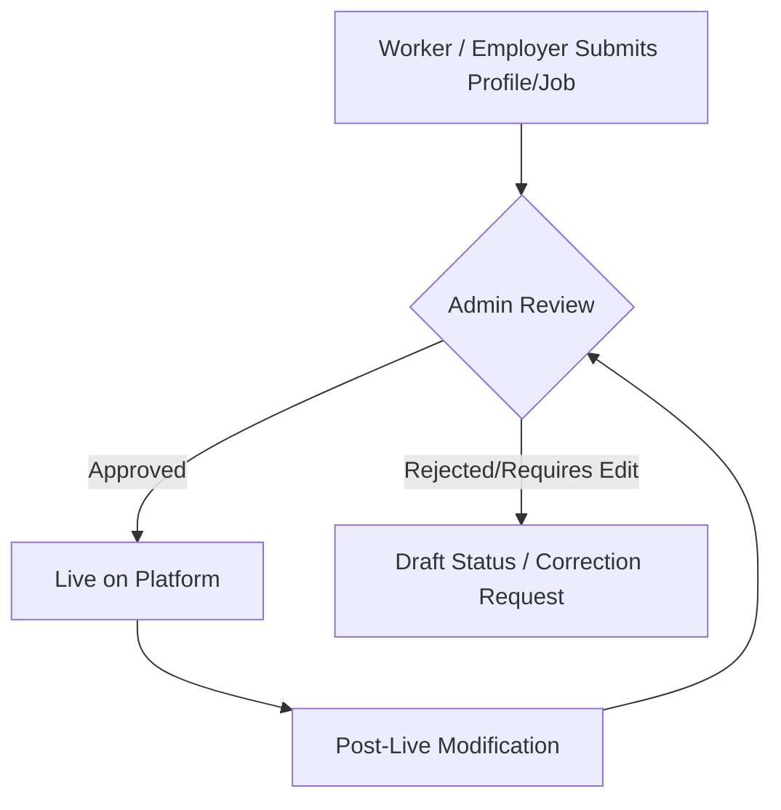
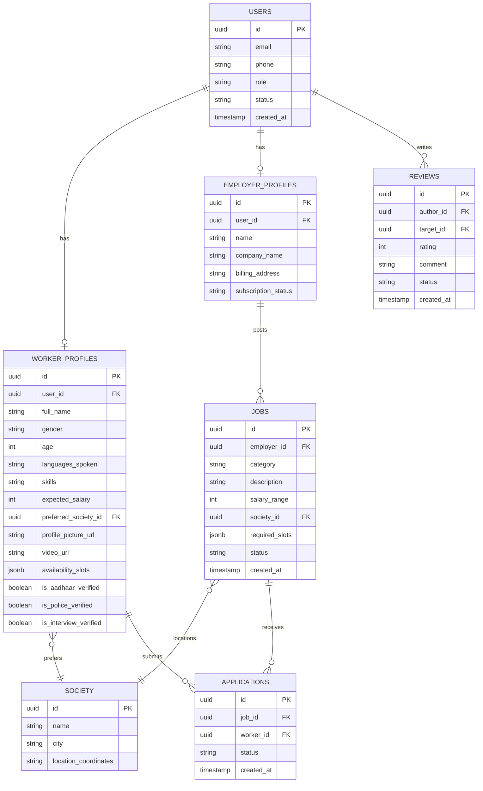

# Product Requirement Document (PRD): Sevikaa

**Document Version:** 1.0.0  
**Status:** Draft / Ready for Review  
**Date:** July 22, 2026  
**Author:** Antigravity (AI Architect)  
**Target Platform:** Web (Next.js + Supabase), Mobile-First  
**Company:** Powered by YugaYatra Retail (OPC) Private Limited  

---

## 1. Executive Summary & Vision

### 1.1 Project Vision
**Sevikaa** is a premium, verified domestic workforce platform connecting trusted domestic workers with verified employers in India. Unlike traditional job portals, Sevikaa operates on a curated model: every public profile, job post, and review must undergo admin moderation and approval before going live.

### 1.2 Core Categories (Version 1)
To maintain focus and high operational quality, Version 1 is strictly restricted to three categories:
1. **Maid** (Cleaning, housekeeping, dusting, etc.)
2. **Cook** (Meal preparation, kitchen management, dietary options)
3. **Nanny** (Childcare, infant supervision, basic tutoring/care)

No other categories (e.g., drivers, security guards, elderly care) will be supported in this release.

### 1.3 Core Business Pillars
*   **Trust:** Zero tolerance for fake profiles. Multiple verification steps (Aadhaar, Police, Mobile, Video, Interview).
*   **Simplicity:** Highly accessible, mobile-first touch interface tailored for users with varying levels of digital literacy.
*   **Verification:** High-contrast badges signaling to employers exactly what checks have passed.
*   **Mobile-First Usability:** Native app-like feel on mobile browsers, minimal form complexity, large tap targets.
*   **Fast Hiring:** Streamlined search prioritizing apartment societies and instant connection mechanisms.

---

## 2. Product Philosophy & Curated Moderation

Sevikaa maintains a strict curation flow. The platform operates on the principle: **"Verified and Moderated by Default."**



*   **Public Visibility:** No worker profile is searchable, and no job posting is viewable by the public or registered users until approved by an Admin.
*   **Ratings & Reviews:** Two-way ratings are held in a pending state until approved or hidden by an Admin.
*   **Video Introductions:** Raw video uploads from workers must be approved by an Admin to verify quality, language appropriateness, and safety.

---

## 3. User Roles & Capabilities Matrix

The platform supports five distinct user groups:

| Role | Pricing / Access | Key Capabilities |
| :--- | :--- | :--- |
| **Visitor** | Free / No Login | View marketing pages, browse basic pricing, browse public FAQ, view safety statements, view sitemap. |
| **Worker** | **Always Free** | Register via Email or Mobile OTP, construct multilingual profile, upload documents (Selfie, Aadhaar, Police verification), upload video introduction, configure weekly availability, apply for jobs, WhatsApp employers directly (upon application), receive SMS/Email notifications, check ratings. |
| **Employer** | **Subscription-Based** | Register, set up home/company profile, post jobs, search workers (filtered by society, skills, availability), save worker profiles, purchase subscription, unlock worker contact details (WhatsApp, phone calls), rate hired workers. |
| **Admin** | Employee Role | Verify workers, verify employers, approve/reject job postings, edit user profiles on request, schedule/log worker interviews, approve/reject video introductions, moderate and approve reviews, manage apartment societies, moderate content. |
| **Super Admin**| Owner Role | Manage admin accounts, view revenue & payment logs, view analytics, manage support cities, configure apartment societies, update subscription pricing, update site settings, manage third-party API keys, inspect security audit logs. |

---

## 4. Workflows & Features (Deep Dive)

### 4.1 Worker Onboarding & Status Progression
The worker registration flow is designed to capture high-trust information step-by-step without overwhelming the worker.

#### Onboarding Funnel:
1.  **Language Selector:** English, Hindi, Hinglish, Kannada, Tamil, Telugu, Assamese, Nepali (must appear *before* login).
2.  **OTP Login:** Handled via Supabase Auth supporting passwordless OTP login via either Email or Mobile Number.
3.  **Selfie:** Face picture capture.
4.  **Basic Details:** Full name, gender, age, permanent address.
5.  **Languages:** Checkbox selection of spoken languages.
6.  **Experience:** History of work.
7.  **Skills:** Selected skills matching Maid, Cook, or Nanny categories.
8.  **Availability:** Weekly schedule grid selector.
9.  **Salary Expectation:** Expected monthly or hourly earnings.
10. **Preferred Society:** Main apartment society targets.
11. **Preferred Areas:** Surrounding location options and service radius.
12. **Documents:** Aadhaar Card (Front/Back) and background check options.
13. **Video Introduction:** Recording/uploading a short self-intro clip.

#### Profile Status Lifecycle:
*   `Pending Review`: Worker registration completed, queued for initial review.
*   `Admin Interview`: Admin interview scheduling and logging.
*   `Approved`: Document checks passed, profile verified.
*   `Live`: Profile is actively visible and searchable by employers on the platform.
*   `Suspended` / `Deactivated`: Profile is hidden due to terms violation or manual request.

---

### 4.2 Availability Engine
Availability is a core USP. The worker designates availability in the system, and employers filter based on matching schedules.

```
Weekly Schedule:
[ Mon ]  [ Tue ]  [ Wed ]  [ Thu ]  [ Fri ]  [ Sat ]  [ Sun ]

Time Slots:
[ ] Early Morning (6:00 AM - 9:00 AM)
[ ] Morning (9:00 AM - 12:00 PM)
[ ] Afternoon (12:00 PM - 3:00 PM)
[ ] Evening (3:00 PM - 6:00 PM)
[ ] Night (6:00 PM - 9:00 PM)

Work Types:
[ ] Full Day (8-12 hours)
[ ] Live-in (24 hours residential)
```

Employers searching for workers can filter workers who are available at the exact slots required by the job post.

---

### 4.3 Society-First Geo-Matching Architecture
Apartment societies are first-class database entities. When users register, their location is pinned to a defined list of Apartment Societies.

*   **Matching Algorithm Priority:**
    1.  **Level 1: Same Society:** Worker preferred society matches the Employer's job society.
    2.  **Level 2: Nearby Society:** Societies within a 1–2 km radius.
    3.  **Level 3: Nearby Location:** Same Sub-locality / Postal code / Service Radius.
*   **Privacy Guard:** To protect worker and employer safety, the platform **never** exposes the exact address or GPS coordinates of any user. Instead, the UI displays:
    *   Sub-locality / Area name.
    *   Approximate distance (e.g., "Within 500 meters", "1.2 km away").
    *   Service Radius (e.g., "Willing to travel up to 3 km").

---

### 4.4 Search Prioritization
Worker search results prioritize matching metrics in the following strict order of sequence:
1.  **Society Match:** Same apartment society matches rank highest.
2.  **Availability Alignment:** Workers who match the exact requested time slots.
3.  **Distance Proximity:** Approximate distance calculations (closest to farthest).
4.  **Skills Matching:** Aligning category experience (Maid, Cook, Nanny details).
5.  **Salary Compatibility:** Aligning worker expectations with job budget.
6.  **Verification level:** Aadhaar/Police verified status boosts ranking.
7.  **Ratings Score:** Average star ratings level.

---

### 4.5 Verification Badges
To provide immediate confidence to employers, visual profiles feature standard color-coded verification badges:

| Badge | Meaning | Active Color | Pending/Missing Color |
| :--- | :--- | :--- | :--- |
| **Mobile Verified** | Phone authenticated via OTP | **Green** (`#34A853`) | **Gray** (`#9E9E9E`) |
| **Aadhaar Verified**| Government ID checked/verified | **Green** (`#34A853`) | **Gray** (`#9E9E9E`) |
| **Police Verified** | Clean background check or PCC | **Green** (`#34A853`) | **Gray** (`#9E9E9E`) |
| **Interview Verified**| Admin interview complete & passed | **Green** (`#34A853`) | **Gray** (`#9E9E9E`) |
| **Video Intro** | Video introduction submitted & approved | **Green** (`#34A853`) | **Gray** (`#9E9E9E`) |
| **Profile Approved**| Overall profile meets quality guidelines | **Green** (`#34A853`) | **Gray** (`#9E9E9E`) |

---

### 4.6 Ratings & Review Moderation System
*   **Two-Way Feedback Loop:** Employers rate Workers; Workers rate Employers (1-5 Stars + Comment).
*   **Moderation Queue:** Ratings are written to the database with `status = 'pending'`. Admins must review review comments to prevent vulgarity, personal contact leaks, or unfair claims.
*   **Review Actions:**
    *   `Approve`: Review becomes public and updates user cumulative rating.
    *   `Reject`: Review is permanently discarded.
    *   `Hide`: Hidden temporarily from public views.
    *   `Restore`: Return a hidden review to public visibility.

---

### 4.7 Subscription Model & Razorpay Integration
*   **Workers:** Free forever. No application fees, no premium tiers.
*   **Employers:** Can view truncated worker lists, but must purchase a subscription to unlock contacts.
*   **Premium Employer Features:**
    *   View full profile details & original video introduction.
    *   Unlock contact information (Phone & WhatsApp).
    *   Initiate WhatsApp chat or call worker.
    *   Unlimited saved worker profiles.
*   **Razorpay Integration:** Required to process subscriptions, single passes, and package updates. Must be compliant with Razorpay terms (requiring comprehensive policy pages in the footer).

---

### 4.8 Communication & Notification Infrastructure
*   **In-App Alerts:** Actionable notifications within the dashboard.
*   **SMS Gateway (MSG91):**
    *   OTP verification.
    *   Job application notifications to workers (sent in preferred language).
    *   Interview request alerts.
*   **Email Engine (Amazon SES):**
    *   Registration emails to employers.
    *   Invoice delivery on Razorpay payments.
    *   Weekly matching digests.

---

## 5. UI/UX Design System & Branding Guidelines

### 5.1 Brand Personality
The platform must reflect the following brand traits across all touchpoints:
*   **Modern**
*   **Professional**
*   **Trustworthy**
*   **Friendly**
*   **Minimal**
*   **Clean**
*   **Premium**
*   **Human-Centric**
*   **Technology Driven**
*   **India First**

### 5.2 Official Color Palette
The identity uses only solid flat colors. **No gradients** are permitted for the primary identity.

#### Color Palette Map:
*   **Primary Colors:** Blue (`#1A73E8`), Red (`#EA4335`), Yellow (`#FBBC05`), Green (`#34A853`).
*   **Neutral Colors:** White (`#FFFFFF`), Light Gray (`#F8F9FA`), Dark Gray (`#202124`), Black (`#000000`).

#### Color Usage Rules:
*   **Blue:** Primary Actions, Links, Interactive Elements
*   **Red:** Alerts, Important Indicators, Brand Accent
*   **Yellow:** Highlights, Warnings, Achievements
*   **Green:** Success, Verification, Completed, Trust
*   **White:** Backgrounds, Cards
*   **Dark Gray / Black:** Typography, Headers, Navigation

### 5.3 Design Principles & Core Philosophy
*   **Philosophy:**
    *   Flat Design & Minimal Design
    *   Solid Colors (no gradients)
    *   Rounded Components
    *   Simple Geometry Icons
    *   High Contrast
    *   Whitespace Focused
    *   Consistent Spacing
    *   Responsive First
    *   Accessibility First
*   **Typography:**
    *   Modern Sans Serif (e.g., *Inter* or *Outfit*)
    *   Bold Headlines, Medium Weight Body
    *   Excellent Readability
    *   Consistent Typography Scale
    *   Do not use decorative fonts
*   **Icon Style:**
    *   Flat Icons
    *   Rounded Corners
    *   Simple Geometry
    *   Minimal Detail
    *   Consistent Stroke Width
*   **Illustration Style:**
    *   Minimal, Vector, Flat
    *   Friendly & Professional
    *   No Photorealistic Illustrations
*   **Buttons:**
    *   Rounded shapes (`rounded-full`)
    *   Solid Fill
    *   Consistent Heights (minimum 48px)
    *   Distinct states: Primary, Secondary, Danger, Success, and Disabled
*   **Cards:**
    *   Rounded corners (`rounded-2xl`)
    *   Subtle Shadow, Flat Appearance
    *   Consistent Padding (e.g., 16px to 24px)
*   **Forms:**
    *   Minimalist layout
    *   Rounded Inputs
    *   Accessible Labels
    *   Clear Validation & Simple Error Messages
*   **Animations:**
    *   Fast & Subtle
    *   Professional & Purpose Driven
    *   No excessive motion or distracting animations
*   **Accessibility:**
    *   WCAG 2.2 AA Compliance
    *   Keyboard Navigation compatible
    *   High Contrast text ratios
    *   Screen Reader Friendly
    *   Touch Friendly layout
    *   Responsive layouts
*   **Responsive Strategy:**
    *   Mobile First, then Tablet, Desktop, and Large Desktop
    *   Consistent spacing tokens and layouts

### 5.4 Core UI Elements Reference
*   **Typography:** Strict scaling from display headers down to captions.
*   **Icons:** Simple shapes matching stroke weights.
*   **Buttons:** Fills matching usage colors (Blue for primary CTA, Green for success, Red for danger).
*   **Cards:** Uniform backdrop color of White (`#FFFFFF`) with subtle outer boundaries.
*   **Forms:** Accessible input tags with floating focus states.

### 5.5 Mobile-First Implementation Rules
*   **Touch Targets:** Interactive components must have a minimum size of 48px x 48px.
*   **One-Tap Primary Actions:** Render main actions immediately in the viewport without deep nesting.
*   **Zero Horizontal Scroll:** Perfect compression down to 360px viewports.

### 5.6 Brand Presence & Scope Assets
The brand name is strictly **Sevikaa**. All components, templates, and platforms must utilize this visual identity consistently across all scope assets:
*   Marketing Website (`sevikaa.in`)
*   Worker Portal & Employer Portal
*   Admin Dashboard & Super Admin Dashboard
*   Future Mobile Apps (iOS / Android wrappers)
*   GitHub Repository Assets
*   Social Media accounts & graphics
*   WhatsApp Business API and templates
*   Email Templates (Amazon SES transaction notifications)
*   Documentation & Presentation slide decks
*   App Icons, Favicons, and Splash Screens

### 5.7 Brand Governance
*   Every future page must strictly use the official logo, palette, typography, icons, buttons, cards, forms, navigation, and tokens.
*   No page or component may introduce a different visual identity under any circumstances.

---

## 6. Public Website Structures & Pages (Razorpay Ready)

The domain `sevikaa.in` must include the following page paths, with a complete footer referencing the official operating entity name: **"Powered by YugaYatra Retail (OPC) Private Limited."**

1.  `/` (Home Page): Core pitch, search bar preview, primary CTA.
2.  `/about`: The team, mission, and company background.
3.  `/how-it-works`: Walkthrough of the worker and employer lifecycle.
4.  `/find-workers`: Search directory with filter system (restricted detail view).
5.  `/find-jobs`: Job listings for workers to search.
6.  `/pricing`: Package tiers for employers (essential for Razorpay onboarding).
7.  `/apartment-solutions`: Specialized partnership plans for housing societies.
8.  `/safety-verification`: Deep dive into how backgrounds and videos are verified.
9.  `/faq`: Frequently Asked Questions for both workers and employers.
10. `/contact`: Help desk, email, office address, and support form.
11. `/blog`: Informative articles and local updates.
12. `/careers`: Job opportunities at Sevikaa corporate.
13. `/privacy-policy`: Standard legal privacy statement.
14. `/terms-conditions`: Detailed terms of service.
15. `/refund-policy`: Subscription refund and cancellation policies (Razorpay compliance requirement).
16. `/shipping-delivery`: Policy stating that all services are digital and instant, hence no shipping is required (Razorpay compliance requirement).
17. `/cookie-policy`: Tracking and cookies notification.
18. `/disclaimer`: General legal usage disclaimer.
19. `/sitemap`: Comprehensive page links directory.

---

## 7. Dashboards Layout Overview

### 7.1 Worker Dashboard (`/worker/dashboard`)
*   **Quick Actions Grid:**
    *   *My Profile:* View/Edit basic details.
    *   *Availability:* Interactive weekly slot calendar.
    *   *Job Applications:* List of applied jobs and status updates.
    *   *Saved Jobs:* Bookmarked openings.
    *   *Interview Requests:* Pending calls/meetings from Admins or Employers.
    *   *Documents:* Aadhaar/Selfie upload panels.
    *   *Verification:* Verification status breakdown (badges).
    *   *Notifications:* Dynamic inbox/notifications list.
    *   *Subscription:* Status verification (always free).
    *   *Wallet:* Earnings, payout log, or reward tokens tracker.
    *   *Settings:* Language change toggle and log out.

### 7.2 Employer Dashboard (`/employer/dashboard`)
*   **Control Panel:**
    *   *Dashboard:* Main overview panel and metrics.
    *   *Post Job:* Simple multi-step job creation wizard.
    *   *Search Workers:* Comprehensive matching directory (filter by society/skills).
    *   *Applications:* List of workers who applied to the employer's jobs.
    *   *Saved Workers:* Quick bookmark list.
    *   *Subscription:* Package details and state.
    *   *Payments:* Payment history, upgrade triggers, card details.
    *   *Contact History:* Call log showing unlocked worker contact information.
    *   *Notifications:* Alerts for new matches and applications.
    *   *Settings:* Manage account profile and billing address.

### 7.3 Admin Dashboard (`/admin/dashboard`)
*   **Control Panel:**
    *   *Pending Workers:* List of profiles awaiting approval.
    *   *Pending Employers:* Corporate/home verification queue.
    *   *Pending Jobs:* Job moderation queue.
    *   *Interviews:* Scheduled calls organizer.
    *   *Reviews:* List of incoming reviews with Approve/Reject/Hide actions.
    *   *Documents:* Image review pane for Aadhaar and selfie verification.
    *   *Verification:* Status indicators management.
    *   *Reports:* Claims, dispute logs, or feedback forms.
    *   *Notifications:* System operational updates.

### 7.4 Super Admin Dashboard (`/super-admin/dashboard`)
*   **Management Control Suite:**
    *   *Everything:* Full access to Admin Dashboard panels.
    *   *Admin Management:* Create, edit, and deactivate Admin accounts.
    *   *Revenue:* Platform billing totals and subscription summaries.
    *   *Analytics:* Graphs showing payments, registrations, active accounts.
    *   *Cities:* Manage support locations.
    *   *Society Management:* Manage list and coordinates of apartment complexes.
    *   *Pricing:* Edit subscription levels and package costs.
    *   *Settings:* Global API configurations (MSG91, AWS SES, Razorpay keys).
    *   *API Keys:* Manage integrations endpoints.
    *   *Audit Logs:* Detailed ledger of administrative edits and status changes.

---

## 8. Database Schema Design (Supabase PostgreSQL)



---

## 9. Technology Stack Specifications

*   **Frontend Framework:** Next.js (App Router) for high-performance server-side rendering (SSR) and optimized SEO routing.
*   **Database & Backend Service:** Supabase. Utilizes Supabase Auth, PostgreSQL database storage, and Supabase Storage buckets for worker video/document uploads.
*   **Styling:** Tailwind CSS. All components must strictly match the flat color scheme, with custom spacing classes ensuring mobile-first compatibility.
*   **Hosting Platform:** Vercel. Continuous deployment integrated with GitHub.
*   **Third-Party Integrations:**
    *   *SMS:* MSG91 (Transactional templates for OTP and alerts).
    *   *Email:* Amazon SES (Transactional notifications, legal documentation, invoices).
    *   *Payments:* Razorpay (Subscription integration, webhook handler, legal policies verification).

---

## 10. Security, Privacy, & Compliance

*   **Role-Based Access Control (RBAC):** Supabase database Row Level Security (RLS) rules will prevent employers or workers from reading administrative queues or editing other profiles.
*   **Administrative Auditing:** A dedicated `audit_logs` table logs every status change (e.g., profile approval, job rejection, account deactivation) tracking:
    *   Admin user ID
    *   Target user/job ID
    *   Old value & New value
    *   Timestamp
*   **Aadhaar/Identity Shielding:** Uploaded government identification documents must be stored in private Supabase buckets, accessible only via signed URLs to verified administrators. Document files are never made public.
*   **Location Obfuscation:** Approximate distance calculations are handled server-side. Precise coordinates are omitted from public API payloads.

---

## 11. Performance Requirements

*   **Speed:** Fast response times and optimized resource loading to handle low-bandwidth networks.
*   **Responsiveness:** Fast interactions with instant touch feedback.
*   **SEO Friendly:** Fully indexable by search engine crawlers with semantic markup.
*   **Production Ready:** Highly stable build configurations ready for Vercel deployment.

---

## 12. Document Administration & Version Control

*   **Version History:** Version history and historical migration logs must be maintained for database schemas and repository releases.
